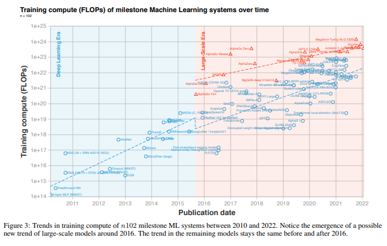

# Scaling-and-Power-Laws-in-Machine-Learning
A collection of papers, datasets, code, and links tracking scaling studies and power law behavior in machine learning

(this page is a work in progress)

## Scaling in Transformer-based Neural Language Models

#### Kaplan 2020: Scaling Laws for Neural Language Models

Kaplan, Jared, Sam McCandlish, Tom Henighan, Tom B. Brown, Benjamin Chess, Rewon Child, Scott Gray, Alec Radford, Jeffrey Wu, and Dario Amodei. "Scaling laws for neural language models." arXiv preprint arXiv:2001.08361 (2020).

https://arxiv.org/abs/2001.08361
 

Summary: 

* Performance depends strongly on scale, weakly on model shape

* Smooth power laws

* Universality of overfitting

* Universality of training

* Transfer improves with test performance

* Sample efficiency

* Convergence is ineffecient

* Optimal batch size

## Phase Transitions

#### Compute Trends Across Three Eras of Machine Learning, Jaime Sevilla, Feb 11, 2022

https://arxiv.org/abs/2202.05924

Sevilla, Jaime, Lennart Heim, Anson Ho, Tamay Besiroglu, Marius Hobbhahn, and Pablo Villalobos. "Compute trends across three eras of machine learning." arXiv preprint arXiv:2202.05924 (2022).

#### Phase Transitions and AGI, Ege Erdil, Metaculus, March 17, 2022

https://www.lesswrong.com/posts/ftdCgGmkQ3bPyDadA/phase-transitions-and-agi

## The Bitter Lesson, Richard Sutton

* http://www.incompleteideas.net/IncIdeas/BitterLesson.html

* https://www.kdnuggets.com/2020/11/revisiting-sutton-bitter-lesson-ai.html
